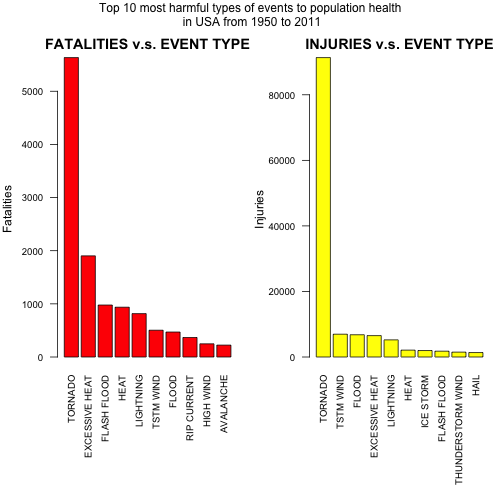
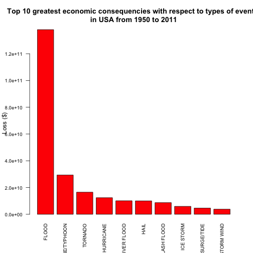
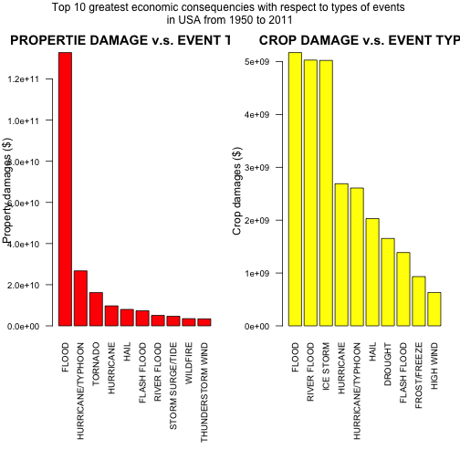

## Introduction

Storms and other severe weather events can cause both public health and economic problems for communities and municipalities. Many severe events can result in fatalities, injuries, and property damage, and preventing such outcomes to the extent possible is a key concern.

In this project, we will try to explore the U.S. National Oceanic and Atmospheric Administration's (NOAA) storm database from 1950 to 2011. This database tracks characteristics of major storms and weather events in the United States, including when and where they occur, as well as estimates of any fatalities, injuries, and property damage. We mainly aim to investigate the following two problems.

1. Across the United States, which types of events (as indicated in the 𝙴𝚅𝚃𝚈𝙿𝙴 variable) are most harmful with respect to population health?

2. Across the United States, which types of events have the greatest economic consequences?

## Data

The data we used for this project come in the form of a comma-separated-value file compressed via the bzip2 algorithm to reduce its size. Here is the access to the data.

https://d396qusza40orc.cloudfront.net/repdata%2Fdata%2FStormData.csv.bz2

There is also some documentation of the database available. 

- National Weather Service Storm Data Documentation, and

https://d396qusza40orc.cloudfront.net/repdata%2Fpeer2_doc%2Fpd01016005curr.pdf

- National Climatic Data Center Storm Events FAQ

https://d396qusza40orc.cloudfront.net/repdata%2Fpeer2_doc%2FNCDC%20Storm%20Events-FAQ%20Page.pdf


## Synopsis

We observed the following facts from the below analysis. 

1. Across the United States, TORNADO is the most harmful event to both fatalities and injuries. It caused at least 5633 of death and 91346 of  injuries from 1955 to 2011.

2. Across the United States, FLOOD have the greatest economic consequence. It caused at least a loss of 138 007 444 500 \$ from 1955 to 2011.

## Data Processing

First, use getwd() to check and use setwd() to set the work directory. The storm data will be download in this directory.


```r
fileUrl <- "https://d396qusza40orc.cloudfront.net/repdata%2Fdata%2FStormData.csv.bz2"
if (!file.exists("StormData.csv.bz2")) {
    download.file(fileUrl, destfile = "StormData.csv.bz2", method = "curl")
} # download storm data if it is not exist
stormData <- read.csv(bzfile("StormData.csv.bz2"))  # read data
str(stormData)
```

```
## 'data.frame':	902297 obs. of  37 variables:
##  $ STATE__   : num  1 1 1 1 1 1 1 1 1 1 ...
##  $ BGN_DATE  : Factor w/ 16335 levels "1/1/1966 0:00:00",..: 6523 6523 4242 11116 2224 2224 2260 383 3980 3980 ...
##  $ BGN_TIME  : Factor w/ 3608 levels "00:00:00 AM",..: 272 287 2705 1683 2584 3186 242 1683 3186 3186 ...
##  $ TIME_ZONE : Factor w/ 22 levels "ADT","AKS","AST",..: 7 7 7 7 7 7 7 7 7 7 ...
##  $ COUNTY    : num  97 3 57 89 43 77 9 123 125 57 ...
##  $ COUNTYNAME: Factor w/ 29601 levels "","5NM E OF MACKINAC BRIDGE TO PRESQUE ISLE LT MI",..: 13513 1873 4598 10592 4372 10094 1973 23873 24418 4598 ...
##  $ STATE     : Factor w/ 72 levels "AK","AL","AM",..: 2 2 2 2 2 2 2 2 2 2 ...
##  $ EVTYPE    : Factor w/ 985 levels "   HIGH SURF ADVISORY",..: 834 834 834 834 834 834 834 834 834 834 ...
##  $ BGN_RANGE : num  0 0 0 0 0 0 0 0 0 0 ...
##  $ BGN_AZI   : Factor w/ 35 levels "","  N"," NW",..: 1 1 1 1 1 1 1 1 1 1 ...
##  $ BGN_LOCATI: Factor w/ 54429 levels ""," Christiansburg",..: 1 1 1 1 1 1 1 1 1 1 ...
##  $ END_DATE  : Factor w/ 6663 levels "","1/1/1993 0:00:00",..: 1 1 1 1 1 1 1 1 1 1 ...
##  $ END_TIME  : Factor w/ 3647 levels ""," 0900CST",..: 1 1 1 1 1 1 1 1 1 1 ...
##  $ COUNTY_END: num  0 0 0 0 0 0 0 0 0 0 ...
##  $ COUNTYENDN: logi  NA NA NA NA NA NA ...
##  $ END_RANGE : num  0 0 0 0 0 0 0 0 0 0 ...
##  $ END_AZI   : Factor w/ 24 levels "","E","ENE","ESE",..: 1 1 1 1 1 1 1 1 1 1 ...
##  $ END_LOCATI: Factor w/ 34506 levels ""," CANTON"," TULIA",..: 1 1 1 1 1 1 1 1 1 1 ...
##  $ LENGTH    : num  14 2 0.1 0 0 1.5 1.5 0 3.3 2.3 ...
##  $ WIDTH     : num  100 150 123 100 150 177 33 33 100 100 ...
##  $ F         : int  3 2 2 2 2 2 2 1 3 3 ...
##  $ MAG       : num  0 0 0 0 0 0 0 0 0 0 ...
##  $ FATALITIES: num  0 0 0 0 0 0 0 0 1 0 ...
##  $ INJURIES  : num  15 0 2 2 2 6 1 0 14 0 ...
##  $ PROPDMG   : num  25 2.5 25 2.5 2.5 2.5 2.5 2.5 25 25 ...
##  $ PROPDMGEXP: Factor w/ 19 levels "","-","?","+",..: 17 17 17 17 17 17 17 17 17 17 ...
##  $ CROPDMG   : num  0 0 0 0 0 0 0 0 0 0 ...
##  $ CROPDMGEXP: Factor w/ 9 levels "","?","0","2",..: 1 1 1 1 1 1 1 1 1 1 ...
##  $ WFO       : Factor w/ 542 levels ""," CI","%SD",..: 1 1 1 1 1 1 1 1 1 1 ...
##  $ STATEOFFIC: Factor w/ 250 levels "","ALABAMA, Central",..: 1 1 1 1 1 1 1 1 1 1 ...
##  $ ZONENAMES : Factor w/ 25112 levels "","                                                                                                                               "| __truncated__,..: 1 1 1 1 1 1 1 1 1 1 ...
##  $ LATITUDE  : num  3040 3042 3340 3458 3412 ...
##  $ LONGITUDE : num  8812 8755 8742 8626 8642 ...
##  $ LATITUDE_E: num  3051 0 0 0 0 ...
##  $ LONGITUDE_: num  8806 0 0 0 0 ...
##  $ REMARKS   : Factor w/ 436781 levels "","\t","\t\t",..: 1 1 1 1 1 1 1 1 1 1 ...
##  $ REFNUM    : num  1 2 3 4 5 6 7 8 9 10 ...
```


By investigating the data structure and with the help of storm data documentation, we can find that the variables "FATALITIES" and "INJURIES" are closely related to population health, and the variables "PROPDMG", "PROPDMGEXP", "CROPDMG" and "CROPDMGEXP" are related to economic consequencies. By a further investigation of "PROPDMGEXP" and "CROPDMGEXP" via levels(stormData\$PROPDMGEXP) and levels(stormData\$CROPDMGEXP), it looks like these two variables are indicating different damage levels. 


```r
levels(stormData$CROPDMGEXP)
```

```
## [1] ""  "?" "0" "2" "B" "k" "K" "m" "M"
```

```r
levels(stormData$PROPDMGEXP)
```

```
##  [1] ""  "-" "?" "+" "0" "1" "2" "3" "4" "5" "6" "7" "8" "B" "h" "H" "K"
## [18] "m" "M"
```

From page 12 of the storm data documentation, we only find an explanation for the abbreviations "B", "K", "M", namely, "B" for billions, "K" for thousands, and "M" for millions. Unfortunately, I couldn't find any explanations for others entries. So we have to first check about the proportion of uncertainty.


```r
summary(stormData$CROPDMG)
```

```
##    Min. 1st Qu.  Median    Mean 3rd Qu.    Max. 
##   0.000   0.000   0.000   1.527   0.000 990.000
```

```r
table(stormData$CROPDMGEXP)
```

```
## 
##             ?      0      2      B      k      K      m      M 
## 618413      7     19      1      9     21 281832      1   1994
```

```r
summary(stormData$PROPDMG)
```

```
##    Min. 1st Qu.  Median    Mean 3rd Qu.    Max. 
##    0.00    0.00    0.00   12.06    0.50 5000.00
```

```r
table(stormData$PROPDMGEXP)
```

```
## 
##             -      ?      +      0      1      2      3      4      5 
## 465934      1      8      5    216     25     13      4      4     28 
##      6      7      8      B      h      H      K      m      M 
##      4      5      1     40      1      6 424665      7  11330
```

We observe, even if we consider "h" and "H" as 10^2, and an integer i between 0 and 9 as 10^i, the proportion of the amount of missing part is still very small. So we will ignore them when we are solving the second problem.

Next, we do something preparation works for problem 1. 


```r
summary(stormData$FATALITIES)
```

```
##     Min.  1st Qu.   Median     Mean  3rd Qu.     Max. 
##   0.0000   0.0000   0.0000   0.0168   0.0000 583.0000
```

```r
summary(stormData$INJURIES)
```

```
##      Min.   1st Qu.    Median      Mean   3rd Qu.      Max. 
##    0.0000    0.0000    0.0000    0.1557    0.0000 1700.0000
```

```r
library(dplyr)
# data1 will be used for solving problem 1.
data1 <- stormData %>%
    select(c(EVTYPE, FATALITIES, INJURIES)) %>%
    group_by(EVTYPE) %>%
    summarise(Fatalities_total = sum(FATALITIES),
              Injuries_total = sum(INJURIES))

#    select(c(EVTYPE, FATALITIES, INJURIES, PROPDMG, PROPDMGEXP, CROPDMG, CROPDMGEXP))
```


Now let's turn to problem 2. 

The following function is customized so that it can produce a final value give a initial value plus a unit.


```r
combine <- function(value, units) {
    l = length(value)
    result <- rep(0, l)
    for (i in 1:l) {
        if (units[i] == "B") {
            result[i] = value[i] * 10^9
        } else if (units[i] %in% c("k", "K")) {
            result[i] = value[i] * 10^3
        } else {
            result[i] = value[i] * 10^6
        }
    }
    result
}
```


```r
library(dplyr)
# data2 will be used for solving problem 2.
data2 <- stormData %>%
    select(c(EVTYPE, PROPDMG, PROPDMGEXP, CROPDMG, CROPDMGEXP)) %>%
    filter(PROPDMGEXP %in% c("B", "k", "K", "m", "M") & 
               CROPDMGEXP %in% c("B", "k", "K", "m", "M")) %>% 
    mutate(Propdmg = combine(PROPDMG, PROPDMGEXP),
           Cropdmg = combine(CROPDMG, CROPDMGEXP)) %>%
    group_by(EVTYPE) %>%
    summarise(Propdmg_total = sum(Propdmg),
              Cropdmg_total = sum(Cropdmg))
```


## Analysis and Result 

### Problem 1. Across the United States, which types of events are the most harmful with respect to population health?

Note that there are totally 985 event types. It's better to reorder the data1 before we plot.


```r
data1.1 <- arrange(data1, desc(Fatalities_total))[1:10, ]
Fatalities_max_value <- data1.1$Fatalities_total[1]
Fatalities_max_name <- data1.1$EVTYPE[1]
data1.2 <- arrange(data1, desc(Injuries_total))[1:10, ]
Injuries_max_value <- data1.2$Injuries_total[1]
Injuries_max_name <- data1.2$EVTYPE[1]
par(mfrow = c(1,2), mar = c(10,4,2,1), oma = c(0, 0, 2,0))
barplot(data1.1$Fatalities_total, names.arg = as.character(data1.1$EVTYPE), main = "FATALITIES v.s. EVENT TYPE", ylab = "Fatalities", cex.axis = 0.8, cex.names = 0.8, las = 2, col = "red")
barplot(data1.2$Injuries_total, names.arg = as.character(data1.2$EVTYPE), main = "INJURIES v.s. EVENT TYPE", ylab = "Injuries", cex.axis = 0.8, cex.names = 0.8, las = 2, col = "yellow")
mtext("Top 10 most harmful types of events to population health \nin USA from 1950 to 2011", outer = TRUE)
```


From above analysis, we conclude that TORNADO is the most harmful events with respect to fatalities. It caused at least 5633 death in USA from 1955 to 2011. And TORNADO is the most harmful events with respect to injuries. It caused at least 9.1346 &times; 10<sup>4</sup> injuries in USA from 1955 to 2011.

### Problem 2. Across the United States, which types of events have the greatest economic consequences?


```r
par(mfrow = c(1,1))
data2_plot <- data2 %>%
    mutate(total_loss = Propdmg_total + Cropdmg_total) %>%
    arrange(desc(total_loss))
data2_plot <- data2_plot[1:10, ]
loss_max_value <- data2_plot$total_loss[1]
loss_max_name <- data2_plot$EVTYPE[1]
barplot(data2_plot$total_loss, names.arg = data2_plot$EVTYPE, main = "Top 10 greatest economic consequencies with respect to types of events \nin USA from 1950 to 2011", ylab = "Loss ($)", cex.axis = 0.8, cex.names = 0.8, las = 2, col = "red")
```



From above analysis, we observe that the FLOOD has the greatest economic consequence in USA from 1955 to 2011. It caused a loss of 1.3800744 &times; 10<sup>11</sup> \$ in total at least in this period.

In the following I made a little bit finner analysis. The results are interesting.


```r
data2.1 <- arrange(data2, desc(Propdmg_total))[1:10, ]
data2.2 <- arrange(data2, desc(Cropdmg_total))[1:10, ]
par(mfrow = c(1,2), mar = c(10,4,2,1), oma = c(0, 0, 2,0))
barplot(data2.1$Propdmg_total, names.arg = as.character(data2.1$EVTYPE), main = "PROPERTIE DAMAGE v.s. EVENT TYPE", ylab = "Property damages ($)", cex.axis = 0.8, cex.names = 0.8, las = 2, col = "red")
barplot(data2.2$Cropdmg_total, names.arg = as.character(data2.2$EVTYPE), main = "CROP DAMAGE v.s. EVENT TYPE", ylab = "Crop damages ($)", cex.axis = 0.8, cex.names = 0.8, las = 2, col = "yellow")
mtext("Top 10 greatest economic consequencies with respect to types of events \nin USA from 1950 to 2011", outer = TRUE)
```


